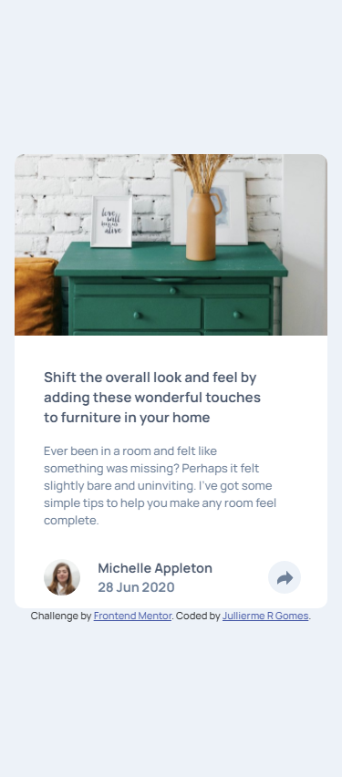
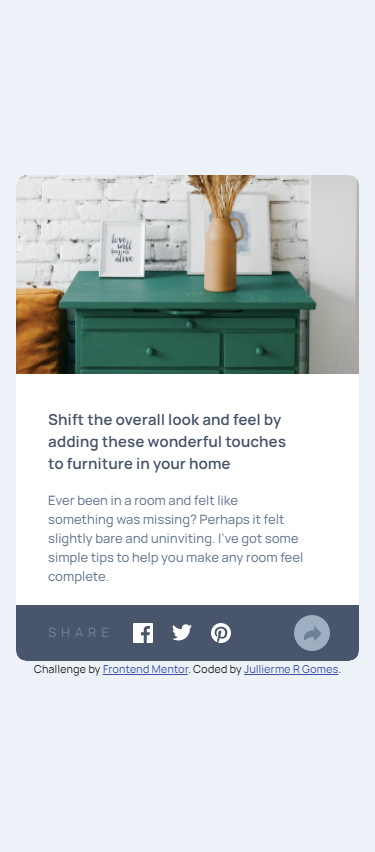
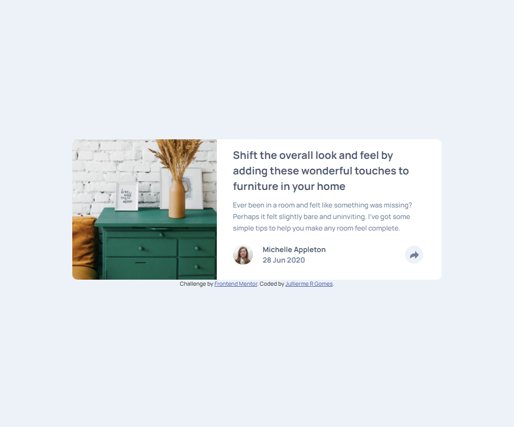
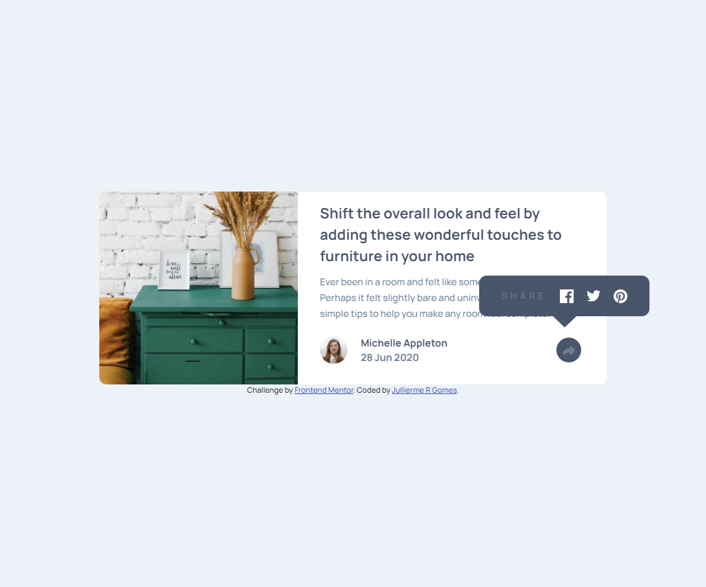

# Frontend Mentor - Article preview component solution

This is a solution to the [Article preview component challenge on Frontend Mentor](https://www.frontendmentor.io/challenges/article-preview-component-dYBN_pYFT). Frontend Mentor challenges help you improve your coding skills by building realistic projects. 

## Table of contents

- [Overview](#overview)
  - [The challenge](#the-challenge)
  - [Screenshot](#screenshot)
  - [Links](#links)
- [My process](#my-process)
  - [Built with](#built-with)
  - [What I learned](#what-i-learned)
  - [Continued development](#continued-development)
  - [Useful resources](#useful-resources)
- [Author](#author)
- [Acknowledgments](#acknowledgments)

## Overview

### The challenge

Your users should be able to: 

- View the optimal layout for the component depending on their device's screen size
- See the social media share links when they click the share icon

### Screenshot

### Links

- Solution URL: [Add solution URL here](https://github.com/jullierme-r/article-preview)
- Live Site URL: [Add live site URL here](https://jullierme-r.github.io/article-preview/)

### Built with

- Semantic HTML5 markup
- CSS custom properties
- Flexbox
- Media Queries
- Mobile-first workflow
- JavaScript

## Author

- GitHub - [Add your name here](https://github.com/jullierme-r)
- Frontend Mentor - [@jullierme-r](https://www.frontendmentor.io/profile/jullierme-r)
